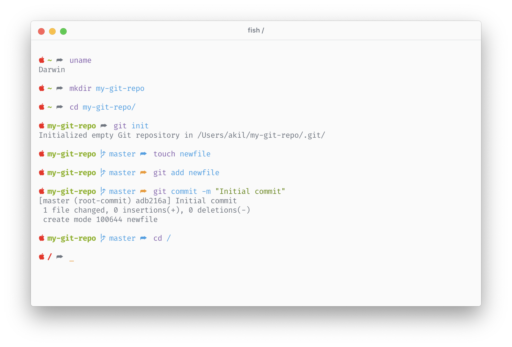

# Page Fish Theme

_Page_ is a simple fish theme with git support. The prompt shows 1 level of the current working directory, branch, and a color coded curved fat arrow.

The arrow color indicates git status:
- No color indicates not in git directory
- Blue indicates clean working tree
- Yellow indicates dirty working tree



## Installation & Usage

Run the [“apply theme” script](./scripts/apply_theme.sh) from fish:

```sh
source scripts/apply_theme.fish
```

**WARNING:** This will clobber your existing prompt.


## Contribution

This is my personal fish theme I maintain for myself. Feel free to fork!
